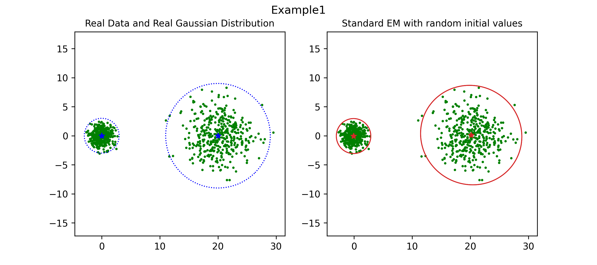

# A Robust EM Clustering Algorithm for Gaussian Mixture Models

## Description

Python implementation of Robust EM Clustering for Gaussian Mixture Models[1].
(Click [here] to view the paper for more detail.)

<br>

- `robustGMM.robustGMM` 

    Scikit-learn API style for Robust GMM
    
- `robustGMM.generator` 

    Generator for synthetic data from mixture of gaussian.

<br>

For more detail to use, see the example below or [paper_example.py]


* Reference

    MS Yang, A robust EM clustering algorithm for gaussian mixture models, Pattern Recognit., 45 (2012), pp. 3950-3961

[here]: https://pdfs.semanticscholar.org/b6f2/9775838dd411a73a9655269b8854b674cf8b.pdf
[paper_example.py]: ./test/paper_example.py

<br>
---

## Install

1. Install from PyPI

    ```bash
    pip install robustGMM
    ```
    
2. Install from Github

    ```bash
    pip install git+https://github.com/HongJea-Park/robust_EM_for_gmm.git
    ```

<br>
---

## Example

All examples are conducted to compare with the experimental results of the paper.

```python
# For more detail, refer ./test/paper_example.py
import numpy as np

from robustGMM import RobustGMM
from robustGMM import Generator_Multivariate_Normal


# Generate data from 2 multivariate normal distribution with fixed random seed
np.random.seed(0)
real_means = np.array([[.0, .0], [20, .0]])
real_covs = np.array([[[1, .0], [.0, 1]],
                      [[9, .0], [.0, 9]]])
mix_prob = np.array([.5, .5])
generator = Generator_Multivariate_Normal(means=real_means,
                                          covs=real_covs,
                                          mix_prob=mix_prob)
X = generator.get_sample(800)

# GMM using robust EM Algorithm
rgmm = RobustGMM()
rgmm.fit(X)
```

## Figures for each examples in paper

1. ### Example 1
    
    

2. ### Example 2
    
    
    
    

3. ### Example 3
    
    

4. ### Example 4
    

5. ### Example 5
    
    

6. ### Example 6
    
    

7. ### Example 7
    

8. ### Computational time cost
    
